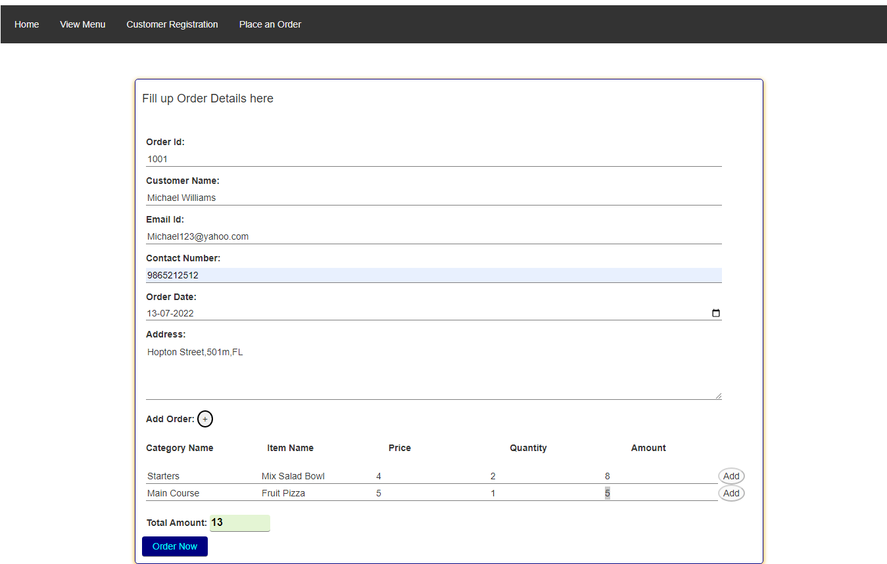

## Challenge - Persist the order details using Axios API for the Veggie Pizza Outlet

### Problem Statement

Veggie Pizza, a pizza delivery outlet, became popular for its custom-made vegetarian pizzas. A customer can order pizzas and other items by calling the outlet. The outlet delivers the order to the address specified by each customer. The outlet now have an app that allows the call operator to view the menu details, enter the order details and persist for future reference.

​Write a JS program that  allows the operator to persist​ the customer details and items ordered,  and show the​ total amount that the customer should pay.

The challenge can be performed by the following steps:
### Step 1 – View Menu details

- The outlet team should be able to view the entire menu details on the app to place an order.​
- Open the file `menu.html` and add HTML code to display the menu items in a tabular format.
- On clicking the "View Menu" link, the menu details should be fetched from the server using Axios API.​
- **Note: As per test requirement, the Menu API should be running on port 3000.**
- Selected menu items should be listed when a particular category is selected, e.g. starters.​
- Edit `menu.js` file to​
  - define the function which fetches the menu data from the server and display it.​
  - define the function to filter the menu items using Array's `filter()` method based on a particular category and display them.​

### Expected Output: For Reference

### Step 2 – Register a New Customer 

- The pizza outlet team should register a new customer as per the details listed in the table.​
- Edit the file `customer.html` to apply the listed HTML5 validations on the registration form fields which are available in the boilerplate.​
- Edit `customer.js` file to​
  - add custom validation functions which displays custom error messages for the field inputs that do not fulfil the validation criteria ​
  - save valid customer details in the `json-server` using Axios API. 
  - **Note: As per test requirement, the Customer API should be running on port 3001.**
  - Once the customer details are saved, the app should display the text `You have successfully registered !` on the page.
  - **Note: This text message will be used to evaluate test case and hence any mismatch between the actual and expected values will result into test case failure.**

| Input Field  | Validation Requirement |
| - | - |
| Customer Id​ | Should not be left blank​ |
| Customer Name​ |Should not be left blank ​|
| Password​ |Should not be left blank and have min 8 characters​ |
| Confirm password​ | Should be same as password value​ |
| Customer Email​ | Should not be left blank and should allow input of type email​ |
| Customer Phone​ | Should not be left blank and should allow valid phone number pattern​ |
| Customer Address​ | Should not be left blank​

### Expected Output: For Reference

### Step 3 – Persist the Order

- The order form created in the previous Sprint challenge should be reused in the file `order.html` of the boilerplate code.​
- Edit the file `order.js` to reuse the solution developed in the previous sprint challenge and modify the code to persist the order details. ​
- As the user enters order items, the text field for “Total Amount” should get continuously updated with the sum of amount of all order items​
- When the user clicks on “Save Order” button, the complete order with all the details should be captured.​
- Persist the captured order details in the `json-server` using Axios API calls.​
- **Note: As per test requirement, the Order API should be running on port 3002.**
- Once the order details are saved, the app should display the text `Total amount to be paid: $<total-amount-value>` on the page.
- **Note: This text message will be used to evaluate test case and hence any mismatch between the actual and expected values will result into test case failure.**

### Expected Output: For Reference

### General Instructions

- The Challenge of this sprint is in continuation to the Challenge of the previous sprint `Sprint 5 - Develop Interactive Web Pages Using DOM and DOM Events`.​
- Modify the existing code to fulfil the requirements stated with the tasks.​
- The unzipped code contains `index.html`, `customer.html`, `menu.html` and `order.html` files which contain the partial design code of the `Veggie Pizza` web application.​
  - Edit the code in `menu.html` to display the menu items in tabular format.
  - Edit the code in `customer.html` to add the required HTML5 validations.​
  - Edit `order.html` file and reuse the code developed in the previous sprint challenge to create the order form.
- Write CSS code in the files located inside `css` folder of the boilerplate to style the web page to get the expected output.​
- Write JavaScript code in the files located inside `js` folder of the boilerplate.
  - Edit the code in `menu.js` file to get the menu details from `json-server` using Axios API. ​
  - Edit the code in `customer.js` to store the customer details using Axios API.​
  - Edit the code in `order.js` to capture and store the order details in json-server using Axios API.​
 - Start json-server for menu, customer and order to manipulate data from `menu.json`, `customer.json`, `order.json` respectively located under `json` folder.​
- As required by the test code, use the port numbers as suggested below for menu, customer and order APIs.
  - menu API --> 3000
  - customer API --> 3001
  - order API --> 3002​
- Open the `index.html` file using Live Server and test the expected output.

### Submission Instructions

1. This is a test enabled practice, hence, the solution will have to ungdergo automated evaluation process.
    - For automated evaluation, the solution should be first tested locally and then on hobbes.
2. Steps to test the code locally:
    1. Ensure the solution code is provided in the specified files only.
    2. From the command line terminal, set the path to the folder containing cloned boilerplate code.
    3. Run the command `npm install` to install the dependencies.
    4. Run the command `npm run test` to test the solution locally.
    5. Ensure all the test cases are passing locally and then push the solution to git for automated testing on `hobbes`.
3. Steps to test the code on hobbes:
    1. Open the submission page at `https://codereview.stackroute.niit.com/#/submission`.
    2. Submit the solution.
    3. For the failed test cases, refactor the code locally and submit it for re-evaluation.

​

​

